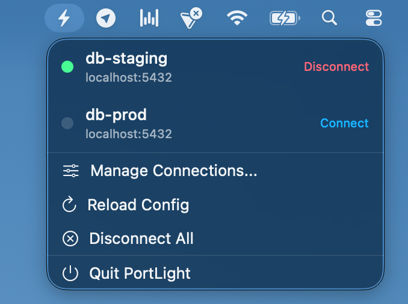

# PortLight

A macOS menu bar app for managing Cloud SQL Proxy connections.

<p align="center">
  
</p>

> While this may seem ever so slightly unnecessary, I'm jumping between connections a lot and need something dead simple. I am happy to replace juggling terminals, forgetting where or what I'm connected to, with a 1-2 click solution.

## Features

- Menu bar interface for quick connection management
- Support for multiple database connections
- Auto-connect on launch option
- Real-time connection status monitoring

## Requirements

- macOS 14.0+
- [Cloud SQL Auth Proxy](https://cloud.google.com/sql/docs/mysql/sql-proxy) binary installed
- GCP credentials configured (`gcloud auth application-default login`)

## Installation

### Quick Install (Terminal)

```bash
curl -L -o PortLight.dmg https://github.com/jwra/portlight/releases/latest/download/PortLight.dmg && open PortLight.dmg
```

Then drag PortLight to your Applications folder.

### Manual Install

1. Download `PortLight.dmg` from the [latest release](https://github.com/jwra/portlight/releases/latest)
2. Open the DMG and drag PortLight to your Applications folder
3. Launch PortLight from Applications

### First Launch

Since the app is not notarized, macOS will show a security warning on first launch:

1. Right-click (or Control-click) on PortLight in Applications
2. Select "Open" from the context menu
3. Click "Open" in the dialog that appears

This is only required once.

## Configuration

On first launch, configure the path to your `cloud-sql-proxy` binary in the "Manage Connections" window.

## Security Considerations

### App Sandbox Disabled

PortLight has **App Sandbox disabled** (`ENABLE_APP_SANDBOX = NO`). This is a necessary trade-off for the app's core functionality:

1. **Process Execution**: The app must execute the `cloud-sql-proxy` binary, which requires spawning external processes
2. **Network Management**: Managing proxy connections requires low-level network socket operations
3. **File System Access**: The app needs to access the proxy binary from user-specified paths

**Mitigations in place:**

- **Hardened Runtime**: The app uses Hardened Runtime for code signing, providing additional security protections
- **No Network Access**: PortLight itself does not make network requests; all networking is handled by the cloud-sql-proxy binary
- **Local Only**: The app only manages local proxy instances and does not transmit any data

### Credential Handling

PortLight does not store or handle GCP credentials directly. It relies on the standard `gcloud` application-default credentials flow.

## License

MIT License
